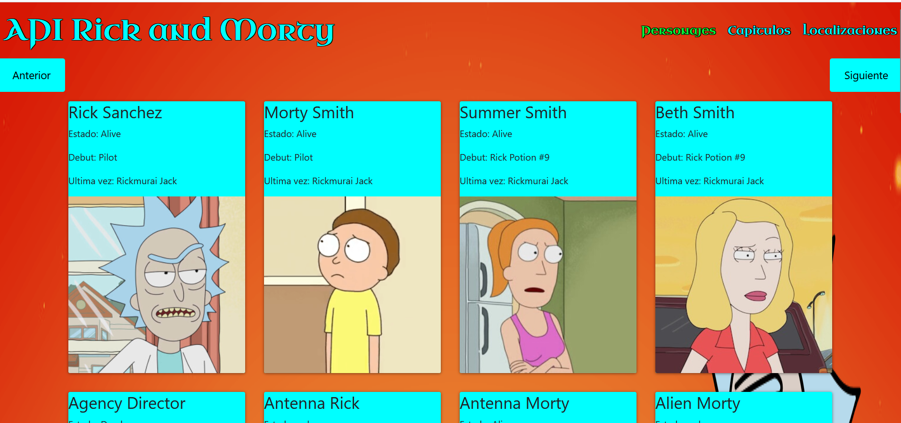
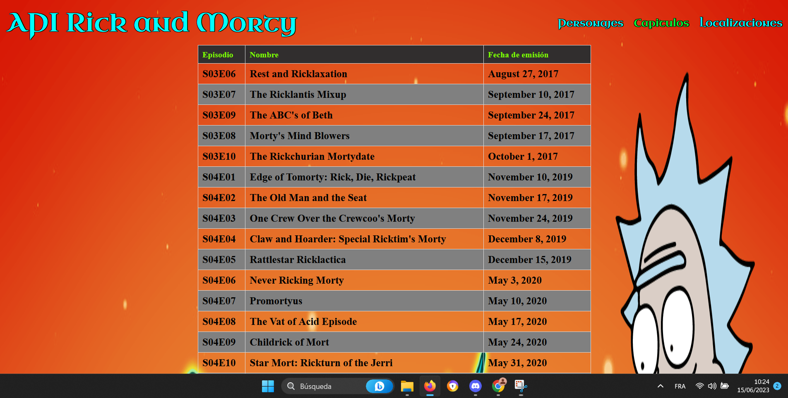
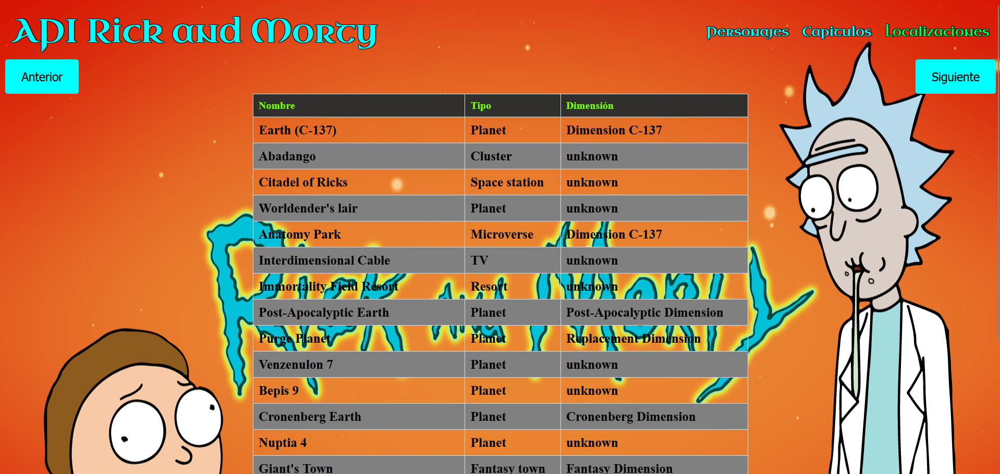

# WEBrickandmorty
### Web que se nutre de la API de Rick and Morty para mostrar datos por pantalla 

### Html y CSS para la parte front

### JS para rellenar tablas

### JS para conexion entre la web y la API externa

